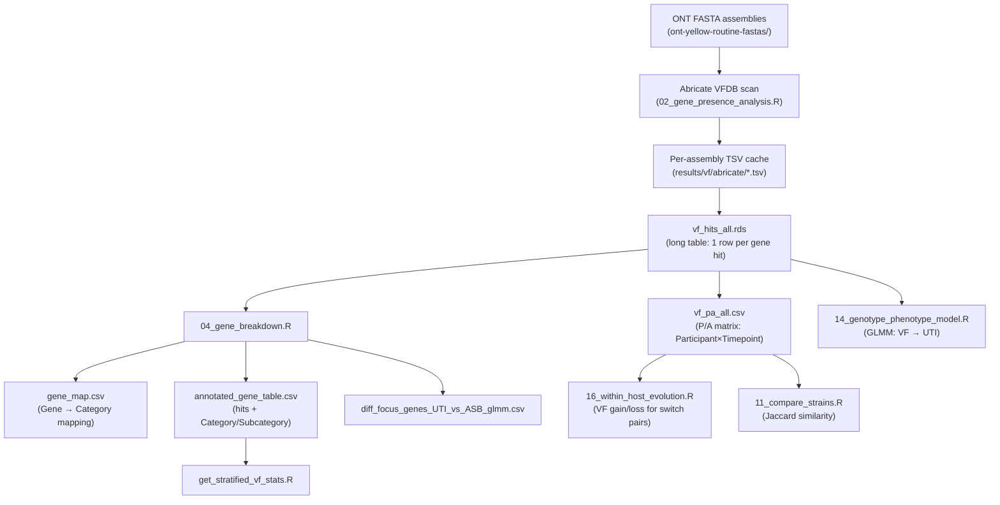

# VF Provenance Map

## VF Detection Method

| Parameter | Value |
|-----------|-------|
| Tool | **Abricate** |
| Database | **VFDB** (Virulence Factor Database) |
| Min Identity | 80% |
| Min Coverage | 80% |
| Script | [02_gene_presence_analysis.R](file:///Users/Aamir/Desktop/rUTIs/02_gene_presence_analysis.R) |
| Cache format | `{basename}.vfdb.id80.cov80.tsv` |

## Data Flow

## Key Files

| File | Path | Rows | Cols | Key Columns | Role |
|------|------|------|------|-------------|------|
| VF hits (long) | `results/vf/vf_hits_all.rds` | ~22K | many | Participant_id, Timepoint, GENE | Raw Abricate output, unnested |
| VF P/A matrix | `results/vf/vf_pa_all.csv` | 183 | 166 | Participant_id, tp_lab, +164 gene cols | **Primary anchor**: binary VF presence |
| Gene map | `results/vf/gene_map.csv` | 209 | 3 | Gene, Category, Subcategory | Heuristic annotation |
| Annotated hits | `results/vf/annotated_gene_table.csv` | 22,102 | 24 | Isolate_ID, Gene, Category | Full hits with categories |
| Gene stats | `results/vf/stats_gene_level.csv` | 164 | 2 | GENE, n_participants | Per-gene prevalence |
| GLMM results | `results/vf/diff_focus_genes_UTI_vs_ASB_glmm.csv` | 7 | 12 | Gene, OR, p | Focus gene GLMM |
| Abricate cache | `results/vf/abricate/` | ~100 files | — | — | Per-assembly TSVs |

## VF Recognition Logic (from script reading)

1. **Assembly input**: All FASTAs in `ont-yellow-routine-fastas/` — 382 assemblies, **all *E. coli*** (confirmed from `assembly_metadata.csv` Organism column: 382/382 = "Escherichia coli")
2. **Abricate call**: `abricate --quiet --db vfdb --mincov 80 --minid 80 {fasta} > {cache}` — run in parallel via `furrr::future_map`
3. **Gene column standardization**: Script checks for GENE/GENE_NAME/NAME/PRODUCT columns in Abricate output
4. **P/A matrix construction**: `distinct(Participant_id, tp_lab, GENE)` then `pivot_wider` — if a gene is detected in *any* assembler (flye or longcycler) for a participant-timepoint, it is marked present
5. **Category annotation**: `04_gene_breakdown.R` uses heuristic regex patterns to categorize genes:
   - `^(fim|fml|pil|foc|sfa|pap|afa|dra|cfa)` → Adhesion/Fimbriae
   - `^(kps|kfi|neu|ugd|rmpA|caps|wzx|wzy)` → Capsule/Surface
   - `^(iut|iuc|iro|irp|fyuA|chu|fep|ent|fec|ybt)` → Iron acquisition
   - `^(hly|cnf|sat|vat|cdt|astA|subAB|stx|lt|st)` → Toxins
   - `^(omp|iss|ibe|tra|usp|malX)` → Invasion/Evasion
   - Anything else → Unassigned

## Downstream Consumers

| Script | Reads | Purpose |
|--------|-------|---------|
| `04_gene_breakdown.R` | `vf_hits_all.rds` | Annotate genes, GLMM focus gene analysis |
| `05_gene_overview_plots.R` | `vf_pa_all.csv` | VF prevalence barplots, heatmaps |
| `11_compare_strains.R` | `vf_pa_all.csv` | Pairwise VF Jaccard similarity |
| `14_genotype_phenotype_model.R` | `vf_hits_all.rds` | GLMM genotype-phenotype model |
| `16_within_host_evolution.R` | `vf_pa_all.csv` | VF gain/loss for phenotype-switch pairs |
| `get_stratified_vf_stats.R` | `annotated_gene_table.csv` | Stratified VF burden stats |
| `compute_vf_abstract_stats.R` | `vf_pa_all.csv`, `gene_map.csv` | **This analysis** |
