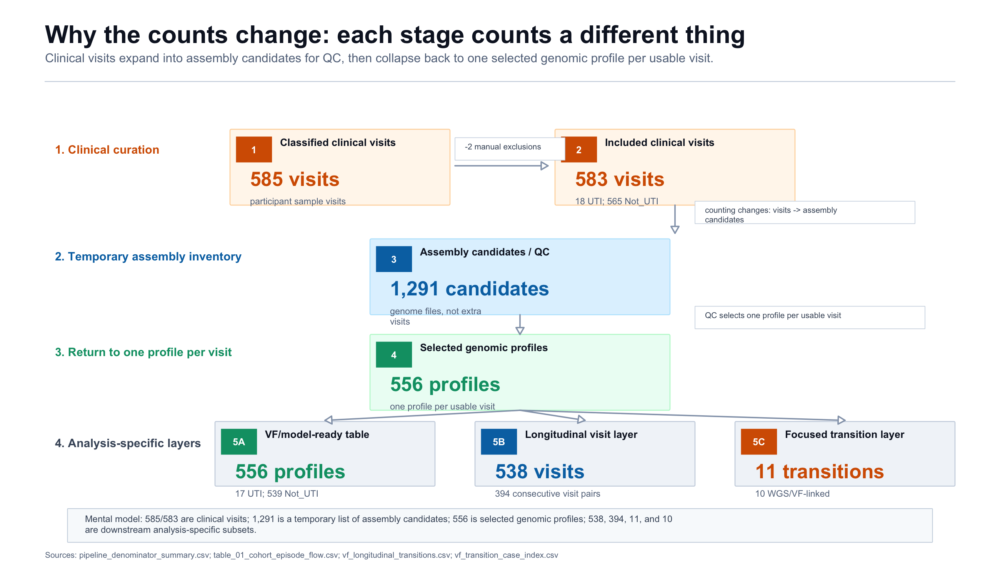
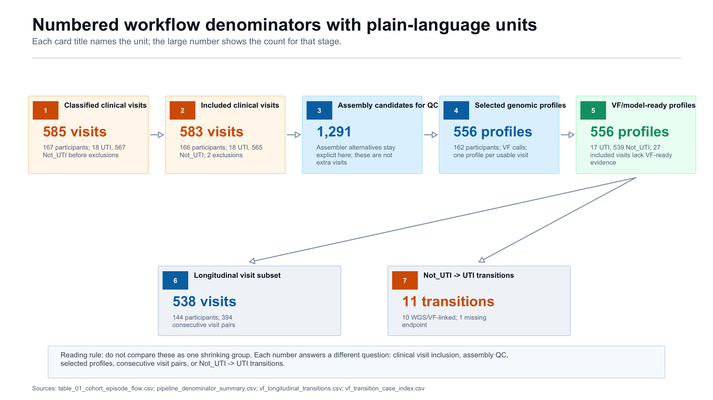
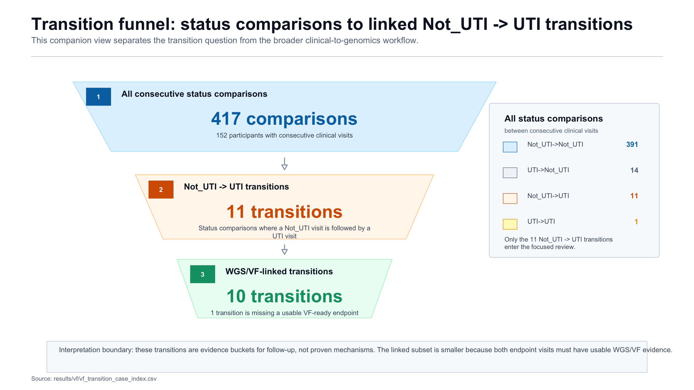

# Workflow Denominator Map

This guide explains why the numbers change as the project moves from clinical visits to genome assemblies, selected genomic profiles, and transition-focused comparisons. The point is that the workflow is not one shrinking cohort; it temporarily changes what is being counted.

## Plain-Language Terms

| Term | Meaning | Count examples |
| :--- | :--- | :--- |
| Clinical visit | One participant urine-sample visit/timepoint with a UTI or Not_UTI status. | 585 classified; 583 included |
| Assembly candidate | One genome assembly file evaluated during QC. A single clinical visit can have more than one candidate assembly. | 1,291 |
| Selected genomic profile | The one chosen genome assembly plus VF profile for a usable clinical visit. | 556 |
| Consecutive VF visit pair | Two neighboring selected genomic profiles from the same participant. | 394 |
| Not_UTI -> UTI transition | A consecutive visit comparison where a Not_UTI visit is followed by a UTI visit. | 11 total; 10 WGS/VF-linked |

## What Is Going On?

The confusing part is `1,291`. That number is not a larger set of people or clinical visits. It is a temporary list of assembly candidates where assembler alternatives and FASTA files are kept separately for QC. After QC, the workflow collapses back to one selected genomic profile per usable clinical visit, which is why the profile count becomes `556`.

A cleaner way to read the main story is: `585` classified clinical visits -> `583` included clinical visits -> temporary expansion to `1,291` assembly candidates -> `556` selected genomic profiles -> analysis-specific subsets such as `538` longitudinal visits, `394` consecutive VF visit pairs, `11` Not_UTI -> UTI transitions, and `10` WGS/VF-linked transitions.

## Images

[SVG version](figures/workflow_flowchart/08_unit_aware_denominator_story.svg)

[SVG version](figures/workflow_flowchart/09_case_count_workflow_ladder.svg)

[SVG version](figures/workflow_flowchart/10_transition_count_funnel.svg)

## How To Read The Counts

- `583` is the included clinical-visit denominator after manual curation exclusions.
- `1,291` is larger because assembly QC counts genome assembly candidates, not extra people or visits.
- `556` is the selected genomic profile denominator: one selected QC-pass assembly and VF profile per usable clinical visit.
- `538` is the repeated-measures longitudinal visit subset; it produces `394` consecutive within-participant VF visit pairs.
- `11` is the Not_UTI -> UTI transition count; `10` of those transitions have WGS/VF-linked endpoints.

## Source Table

| Step | Count shown | Human-readable unit | Technical source unit | Source | Notes |
| :--- | :--- | :--- | :--- | :--- | :--- |
| Classified clinical visits | 585 | clinical visit | clinical_episode | `results/qc/pipeline_denominator_summary.csv` | Before primary manual curation exclusions; 18 UTI and 567 Not_UTI. |
| Included clinical visits | 583 | clinical visit | clinical_episode | `results/qc/pipeline_denominator_summary.csv` | 166 participants; 18 UTI and 565 Not_UTI. |
| Assembly candidates for QC | 1,291 | assembly candidate | assembly | `results/qc/pipeline_denominator_summary.csv` | Includes assembler alternatives, so it is not a clinical-visit count. |
| Selected genomic profiles | 556 | selected profile | participant_timepoint | `results/qc/pipeline_denominator_summary.csv` | 162 participants; one selected QC-pass profile per usable clinical visit. |
| VF/model-ready profiles | 556 | selected profile | participant_timepoint | `results/qc/pipeline_denominator_summary.csv` | 17 UTI and 539 Not_UTI. |
| Longitudinal visit subset | 538 | clinical visit with selected profile | participant_timepoint | `results/summary/table_01_cohort_episode_flow.csv` | 144 participants represented in VF transition output. |
| Consecutive VF visit pairs | 394 | consecutive visit pair | participant_timepoint pair | `results/vf/vf_longitudinal_transitions.csv` | Derived from the longitudinal subset; 144 participants. |
| All consecutive status comparisons | 417 | status comparison | clinical_episode_transition | `results/vf/vf_transition_case_index.csv` | 152 participants with consecutive ordered clinical states. |
| Not_UTI -> UTI transitions | 11 | transition | clinical_episode_transition | `results/vf/vf_transition_case_index.csv` | Focused transition denominator. |
| WGS/VF-linked Not_UTI -> UTI transitions | 10 | linked transition | clinical_episode_transition | `results/vf/vf_transition_case_index.csv` | 1 transition lacks a usable VF-ready endpoint. |

## Validation

The figures and this Markdown file were generated by `scripts/create_workflow_case_count_flowchart.R`. The script re-reads the source CSVs and stops if the expected counts in this document drift from the current audited outputs.
