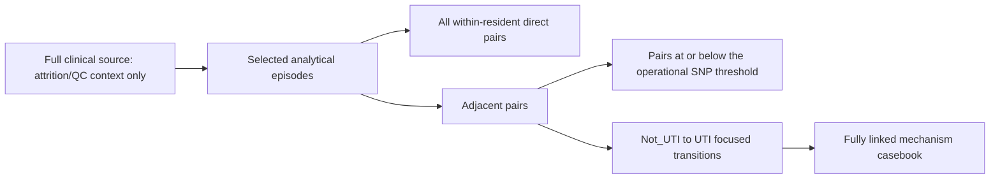

# Longcycler-only denominator map

The analytical release and full-source attrition/QC context are distinct and must not be combined.

## Denominator flow

## Reading rule

Counts change because the unit changes from source episodes, to selected analytical episodes, to pairs and finally to focused transitions. They do not represent one simple attrition ladder.

## Audited release contract

- Scope: Longcycler-only selected QC-passing assemblies; one selected assembly per analytical episode.
- Clinical definition: operational UTI phenotype. It is a versioned culture-plus-compatible-symptom rule, not a reconstruction of the full published protocol.
- Analytical cohort: 532/161/16/516 (episodes/residents/operational UTI/operational Not_UTI).
- Direct evidence: 893 all within-resident pairs.
- Adjacent evidence: 371/139/140 (pairs/residents/pairs at or below 25 SNP).
- Focused transitions: 9 Not_UTI -> UTI; 5/9 at or below 25 SNP.
- Mechanism casebook: 9/9/0 (cases/linked/missing).
- Near-miss audit: 17 rows; these are not operational UTI cases.
- Attrition/QC context only: 583/166/18/565 (full-source episodes/residents/operational UTI/operational Not_UTI); these are not analytical denominators.
- Research-question boundary: RQ01-RQ10 only.
- Interpretation: exploratory, observational and non-causal.

## Methods fixed by the registry

- Operational phenotype: culture lower bound >=1,000 CFU/mL plus compatible symptoms under the versioned rule.
- Assembly QC: <=200 contigs, N50 >=20,000 bp and genome size 4,000,000-6,000,000 bp; read coverage, completeness and contamination are excluded metrics.
- VF calls: ABRicate with VFDB at >=80% identity and >=80% coverage, SHA-bound to the selected Longcycler FASTA manifest.
- MLST: lineage context only; provider calls require >=95% good targets. Policy: provider_qc95 call key/path-linked to the selected Longcycler episode; local fallback excluded. When required, local calls are labelled and use the same selected FASTA.
- Pair-specific evidence: dnadiff is primary, with an operational threshold of <=25 SNP; MLST or graph context cannot overrule a conflicting direct pair.
- Population context: Parsnp core-genome and Panaroo pangenome outputs provide context, not pair-specific continuity proof.

## Provenance

- Claim registry: `results/pipeline/longcycler_release_claim_registry.json`
- Registry SHA-256: `87f65979259a4c92545afbb74b5d3a8efffb8a3d18cd2481df165b97e5c6d30e`
- Registry generated: 2026-07-15 01:36:53 CEST
- This file is generated; edit the registry-producing analysis or this writer rather than hand-editing release claims.

