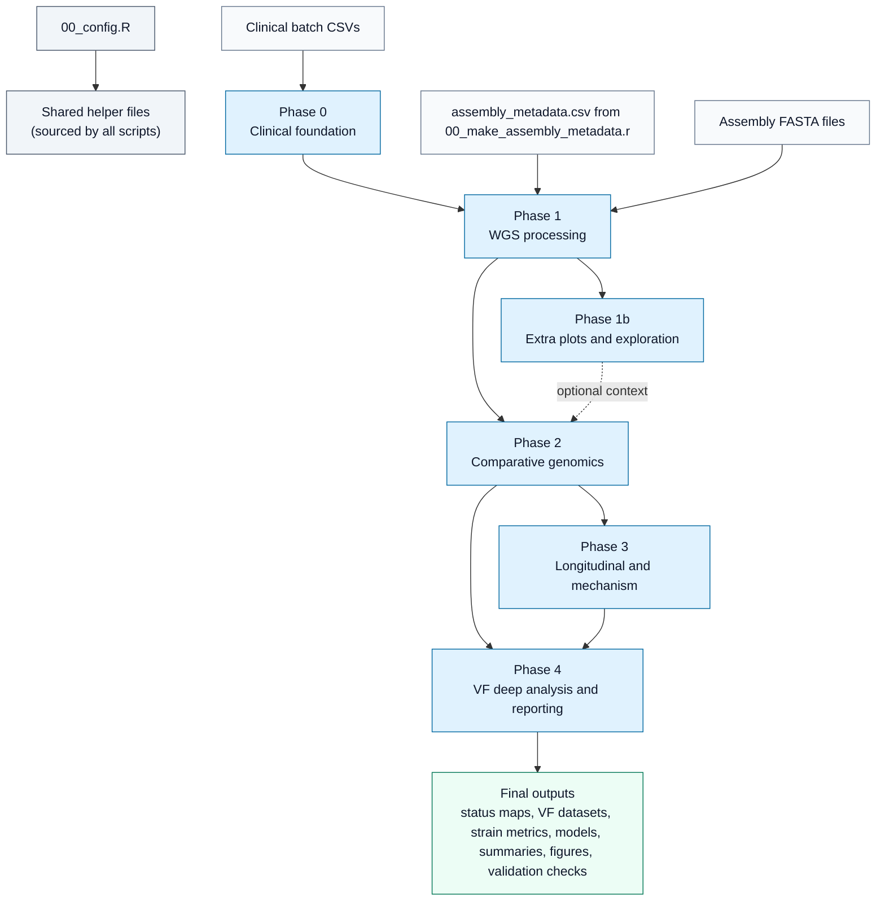
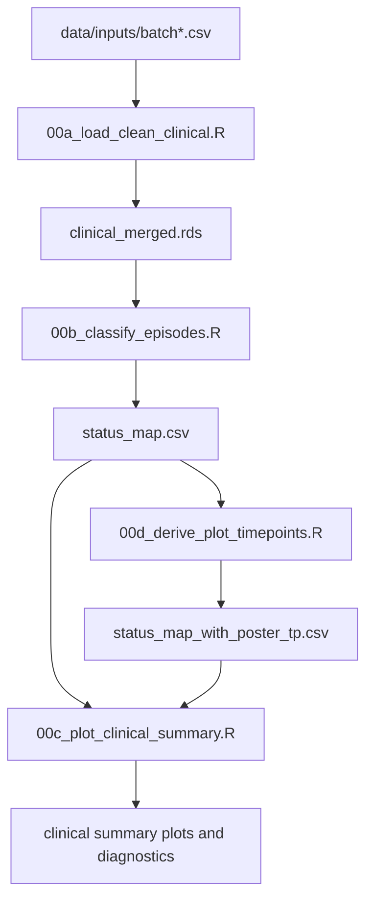
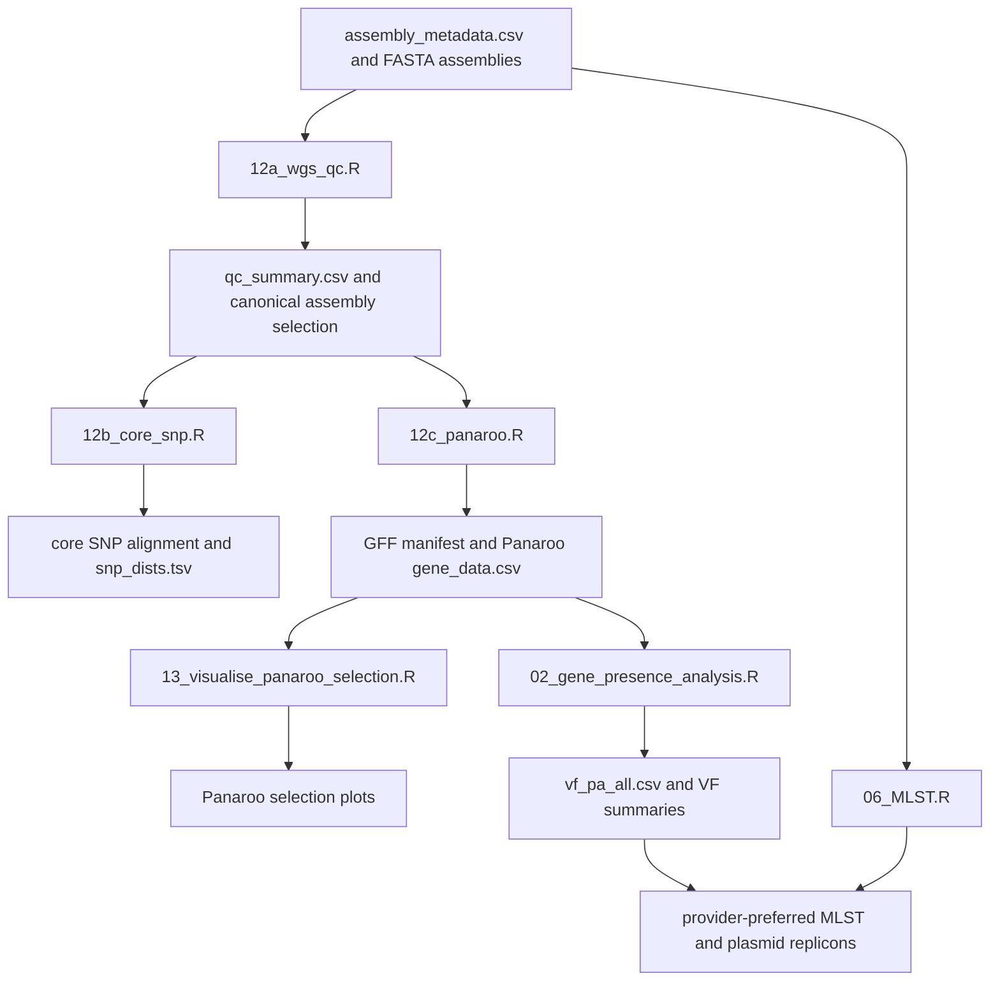
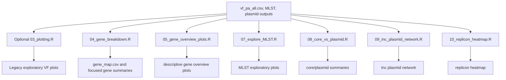
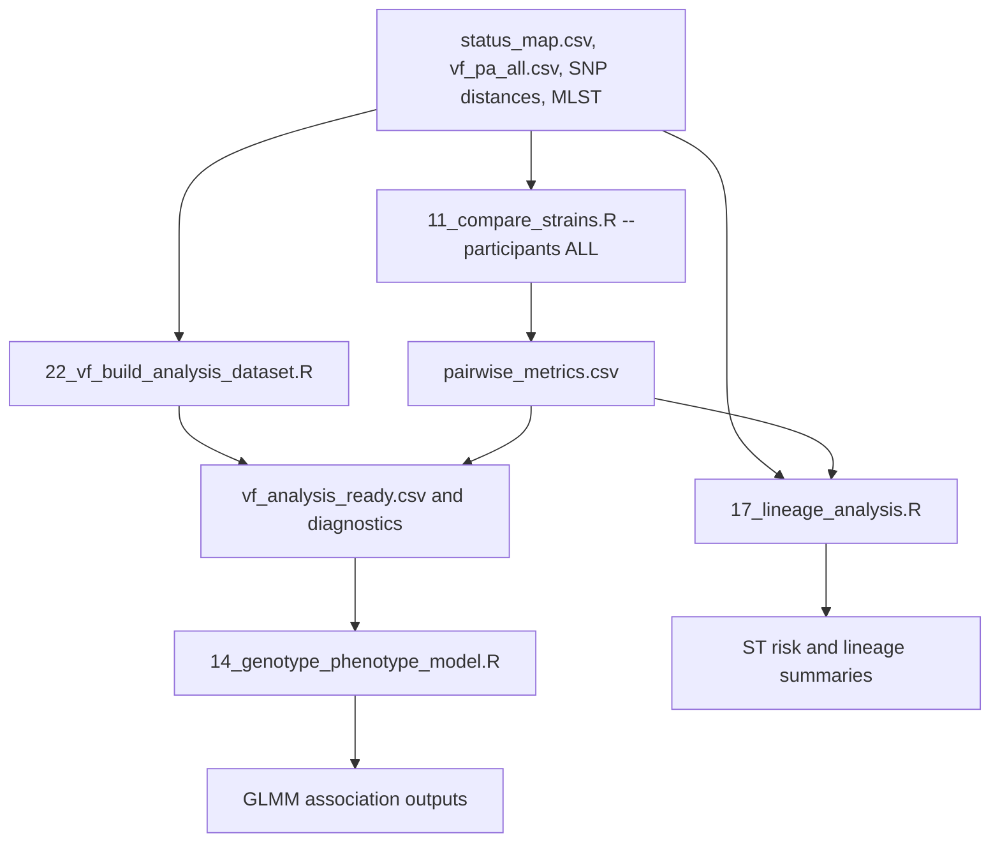
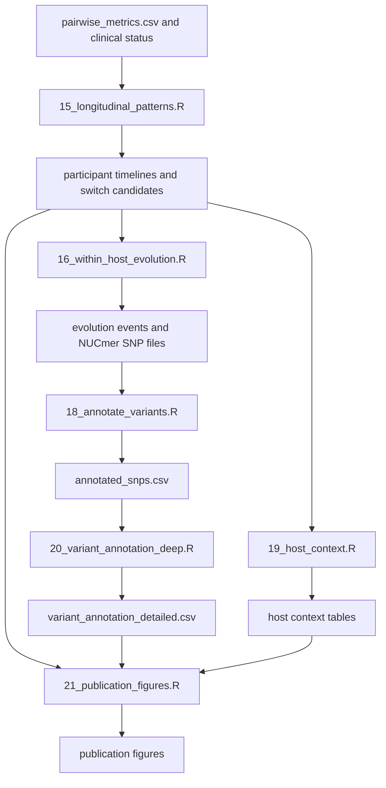
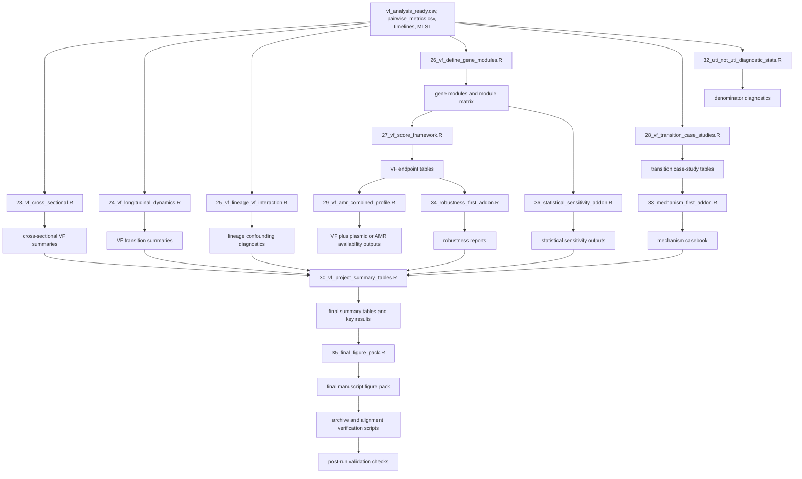

# rUTIs Workflow Flowchart Guide

This guide explains the current workflow executed by `RUN_COMPLETE_ANALYSIS.sh`.
It is meant to help a new collaborator understand the pipeline in order: what
each script reads, what it does internally, what it writes, and why the next
step needs it.

## Source of truth and scope

- Source of truth for run order: `RUN_COMPLETE_ANALYSIS.sh`.
- Scope: scripts called by the main runner, plus shared helper files they source.
- Not in main flow: legacy scripts, one-off audit scripts, old deck-building
  scripts, and exploratory utilities that are not called by the runner.
- Important prerequisite: `assembly_metadata.csv` should be current. It is built
  by `00_make_assembly_metadata.r`, but that script is not called inside the main
  runner.
- Optional step: `03_plotting.R` runs only when
  `RUN_LEGACY_EXPLORATORY_PLOTS=1`. The runner skips it by default.

## Shared foundation

These files are not pipeline steps, but many scripts depend on them.

- `00_config.R`: defines paths, constants, manual curation helpers, status
  filters, strain thresholds, and output directories.
- `R/clinical_helpers.R`: normalizes clinical fields and supports UTI rule
  classification.
- `R/wgs_helpers.R`: handles assembly metadata, FASTA paths, WGS manifests, and
  external-tool support.
- `R/pipeline_qc_helpers.R`: writes denominator and QC summaries used across
  clinical, WGS, and plotting steps.
- `R/plot_helpers.R`: centralizes plot colors and styling, including primary
  UTI vs Not_UTI colors.
- `11_compare_strains_helpers.R`: shared pairwise strain comparison helpers used
  by scripts `11` and `16`.

## Rendered diagram exports

The Mermaid source below stays editable in Markdown. Professionally rendered
exports are also available for slide decks, documents, and quick visual review.
Use SVG for publication-quality vector graphics and PNG for simple previews.

| Diagram | SVG | PNG |
|:--|:--|:--|
| Full pipeline | [SVG](figures/workflow_flowchart/01_full_pipeline.svg) | [PNG](figures/workflow_flowchart/01_full_pipeline.png) |
| Phase 0 clinical foundation | [SVG](figures/workflow_flowchart/02_phase0_clinical_foundation.svg) | [PNG](figures/workflow_flowchart/02_phase0_clinical_foundation.png) |
| Phase 1 WGS processing | [SVG](figures/workflow_flowchart/03_phase1_wgs_processing.svg) | [PNG](figures/workflow_flowchart/03_phase1_wgs_processing.png) |
| Phase 1b exploration | [SVG](figures/workflow_flowchart/04_phase1b_exploration.svg) | [PNG](figures/workflow_flowchart/04_phase1b_exploration.png) |
| Phase 2 comparative genomics | [SVG](figures/workflow_flowchart/05_phase2_comparative_genomics.svg) | [PNG](figures/workflow_flowchart/05_phase2_comparative_genomics.png) |
| Phase 3 longitudinal and mechanism | [SVG](figures/workflow_flowchart/06_phase3_longitudinal_mechanism.svg) | [PNG](figures/workflow_flowchart/06_phase3_longitudinal_mechanism.png) |
| Phase 4 VF deep analysis | [SVG](figures/workflow_flowchart/07_phase4_vf_deep_analysis.svg) | [PNG](figures/workflow_flowchart/07_phase4_vf_deep_analysis.png) |

## Output, Figure, and Statistics Catalog

The script summaries below name the main conceptual outputs so the workflow is
easy to follow. The fuller inventory of statistics, images, tables, text
reports, validation checks, and final figure manifests is maintained in
[`workflow_output_catalog.md`](workflow_output_catalog.md). Use that companion
catalog when you need to explain exactly which CSV, PNG, PDF, Markdown, RDS, or
QC file a script produces.

Interpretation labels used in this guide:

- Descriptive: counts, plots, or summaries that explain the data but do not make
  formal adjusted claims.
- Exploratory: hypothesis-generating tests or screens, usually limited by sparse
  UTI counts, repeated residents, lineage structure, or rare features.
- Inferential/model: participant-aware or model-based analyses, still interpreted
  with sparse-count and confounding guardrails.
- Diagnostic/QC: denominator, freshness, alignment, selection-bias, or validation
  checks.

## Full Pipeline Flowchart

## Phase 0: Clinical Data Foundation

This phase turns raw clinical exports into the primary `UTI` vs `Not_UTI`
status map used everywhere else.

### `00a_load_clean_clinical.R`

- Purpose: merges all available clinical batch CSVs into one harmonized clinical
  object.
- Inputs: `data/inputs/batch*.csv`, with batch definitions from `00_config.R`.
- Main operations: reads available batch files, standardizes column names and
  types, separates signs-and-symptoms columns, normalizes participant/timepoint
  identifiers, and records missing batch files as warnings rather than crashes.
- Outputs: `results/clinical/intermediate/clinical_merged.rds`.
- Statistics/images: no formal tests or figures; writes a symptom-column map so
  later rule classification is auditable.
- Downstream use: `00b_classify_episodes.R` uses this merged object to classify
  each episode.
- Guardrail: this script prepares data only; it does not decide whether an
  episode is UTI.

### `00b_classify_episodes.R`

- Purpose: creates the authoritative primary clinical label for each episode:
  `UTI` or `Not_UTI`.
- Inputs: `clinical_merged.rds` and clinical helper rules.
- Main operations: applies catheter-aware symptom logic, culture support rules,
  CFU threshold logic, legacy-comparison fields, manual curation flags, and
  participant/timepoint keys.
- Outputs: `results/clinical/status_map.csv` and related clinical audit fields.
- Statistics/images: no plots; writes classification, reclassification,
  symptom-rule, CFU-threshold, and legacy-comparison audit tables.
- Downstream use: WGS, VF, modelling, longitudinal, and validation scripts join
  against this status map.
- Guardrail: `UTI_Status` and `UTI_binary` are the current primary contrast;
  legacy ASB/UTI fields are for comparison only.

### `00d_derive_plot_timepoints.R`

- Purpose: creates display-only timepoint positions for Uricult/event samples.
- Inputs: `status_map.csv` and raw batch CSV collection dates.
- Main operations: recovers collection dates, orders routine visits, places
  Uricult samples between routine timepoints where possible, and records placement
  confidence.
- Outputs: `results/clinical/status_map_with_poster_tp.csv`,
  `unplaced_uricult_rows.csv`, and `display_only_uricult_rows.csv`.
- Statistics/images: no formal tests or plots; produces display-placement audit
  tables for Uricult/event rows.
- Downstream use: clinical summaries and transition/case-study figures can use
  the poster-safe timepoint labels.
- Guardrail: derived poster timepoints are display approximations only and must
  not be used as statistical covariates.

### `00c_plot_clinical_summary.R`

- Purpose: visualizes the clinical cohort and the current primary classification.
- Inputs: `status_map.csv`, poster timepoint map when available, and clinical
  helper outputs.
- Main operations: summarizes episode counts, status composition, timepoint
  patterns, culture/symptom provenance, and clinical trajectories.
- Outputs: clinical plots under `plots/clinical/` and clinical summary
  diagnostics.
- Statistics/images: descriptive-only counts; creates trajectory, transition,
  assembly-QC, waterfall, reclassification, subgroup, symptom-rule, and
  CFU-threshold provenance PNGs.
- Downstream use: provides visual QA for the clinical denominator before genomic
  interpretation.
- Guardrail: plots explain the current denominator; they do not modify labels.

## Phase 1: WGS Processing

This phase turns selected assemblies into QC summaries, SNP distances,
pangenome outputs, VF gene matrices, and MLST lineage calls.

### `12a_wgs_qc.R`

- Purpose: checks assembly quality and selects the canonical assembly set for
  downstream participant-timepoint analyses.
- Inputs: `assembly_metadata.csv`, assembly FASTA paths, and `status_map.csv`
  when available for QC-bias checks.
- Main operations: computes contig count, total length, N50, GC content, missing
  file status, manual curation exclusions, QC pass/fail labels, and selected
  rows per biological episode.
- Outputs: `results/wgs/qc_summary.csv`, canonical selection files, QC-bias
  reports, and `plots/wgs/wgs_qc_n50_vs_contigs.png`.
- Statistics/images: descriptive assembly metrics plus Fisher exact QC-selection
  bias check by primary status when status data are available.
- Downstream use: `12b_core_snp.R` and `12c_panaroo.R` use the current selected
  PASS assembly set.
- Guardrail: QC is assembly-level, but downstream biology should use the
  selected participant-timepoint assembly set.

### `12b_core_snp.R`

- Purpose: builds core-genome SNP distances to distinguish same-strain
  persistence from replacement.
- Inputs: canonical WGS selection from `12a_wgs_qc.R` and selected FASTA files.
- Main operations: fingerprints input FASTAs, creates a clean Parsnp input
  directory, runs Parsnp, converts alignment output if needed, runs `snp-dists`,
  builds pairwise SNP tables, and records an input hash for freshness checks.
- Outputs: `results/wgs/core/core.aln.fasta`,
  `results/wgs/core/snp_dists.tsv`, `results/wgs/core/strain_pairs.csv`, and
  tree/alignment artifacts.
- Statistics/images: no association tests; builds pairwise SNP distances,
  same/related/different calls, a neighbor-joining tree, and staleness reports.
- Downstream use: `11_compare_strains.R`, `15_longitudinal_patterns.R`,
  `24_vf_longitudinal_dynamics.R`, and transition case studies use SNP evidence.
- Guardrail: SNP evidence is primary for same-strain interpretation; missing SNP
  evidence remains missing evidence rather than being replaced by ST.

### `12c_panaroo.R`

- Purpose: prepares GFF annotations and runs Panaroo for pangenome analysis.
- Inputs: canonical QC PASS assemblies from `12a_wgs_qc.R`, existing GFF files,
  and selected FASTA files.
- Main operations: validates the current selected set, regenerates missing or
  empty GFF files, writes a GFF manifest, decides whether Panaroo outputs are
  stale, and runs Panaroo when needed.
- Outputs: Panaroo pangenome outputs under `results/wgs/pan/`, regeneration
  summaries, manifests, and freshness hashes.
- Statistics/images: no statistical tests or figures; writes completeness,
  GFF-regeneration, missing-GFF, and staleness diagnostics.
- Downstream use: `02_gene_presence_analysis.R` parses pangenome/gene outputs;
  mechanism scripts can use accessory gene context.
- Guardrail: if selected assemblies changed, downstream pangenome outputs should
  be regenerated before VF interpretation.

### `13_visualise_panaroo_selection.R`

- Purpose: visualizes which assemblies and participant-timepoints entered the
  Panaroo/WGS selection.
- Inputs: QC selection files, GFF manifests, status map, and WGS helper outputs.
- Main operations: summarizes selected, missing, excluded, and available
  assemblies across participants and timepoints.
- Outputs: Panaroo selection overview plots under `plots/wgs/` and selection
  diagnostics.
- Statistics/images: descriptive selection plots plus a Fisher exact
  selection-bias check by status when a valid status table is available.
- Downstream use: helps explain why some clinical rows do or do not appear in
  the genomic/VF dataset.
- Guardrail: this is a QA/visualization step, not an inclusion-rule change.

### `02_gene_presence_analysis.R`

- Purpose: converts gene detection outputs into the canonical VF
  presence/absence matrix.
- Inputs: Panaroo/gene detection outputs, ABRicate VFDB-style files when
  available, selected assembly information, and optional selection arguments.
- Main operations: filters gene hits using identity/coverage thresholds, builds
  isolate-by-gene binary matrices, summarizes VF burden, writes gene metadata,
  and can skip expensive NUCmer work when requested.
- Outputs: `results/vf/vf_pa_all.csv`, VF hit tables, gene maps, and VF overview
  plots/tables.
- Statistics/images: descriptive gene prevalence and per-isolate burden plots;
  no UTI-vs-Not_UTI inference is performed here.
- Downstream use: almost all VF analysis scripts, including `22`, `23`, `24`,
  `26`, `27`, and final figure scripts.
- Guardrail: this is a genomic detection matrix; it does not measure expression,
  virulence activity, or causality.

### `06_MLST.R`

- Purpose: integrates the active RIVM/provider-preferred MLST lineage calls.
- Inputs: assemblies, provider MLST files when available, local MLST outputs,
  and helper integration functions.
- Main operations: loads provider-preferred typing, reconciles sample IDs,
  normalizes ST labels, compares local/provider calls when possible, and writes
  active MLST tables.
- Outputs: `results/mlst/mlst_provider_preferred.csv`, `mlst_all.tsv`, MLST
  summaries, and plasmid replicon tables when available.
- Statistics/images: no plots in the wrapper; helper scripts write provider/local
  source audits and guardrail checks for ST provenance.
- Downstream use: `22`, `17`, `25`, `27`, `29`, `30`, `35`, and sensitivity
  scripts use ST/lineage context.
- Guardrail: ST is lineage context; it does not by itself prove same strain.

## Phase 1b: Additional Plots and Exploration

This phase generates descriptive gene, MLST, and plasmid views. It helps explain
the data but is not the core statistical engine.

### `03_plotting.R` optional

- Purpose: produces older exploratory VF plots when explicitly enabled.
- Inputs: `vf_pa_all.csv`, clinical status data, and plotting helpers.
- Main operations: generates legacy descriptive plots and descriptive statistics.
- Outputs: exploratory VF plots and `results/stats_descriptive.md`.
- Statistics/images: legacy descriptive summaries, optional Wilcoxon text output,
  persistence UpSet plots, tree/timeline/network plots, and old ASB-vs-UTI
  volcano material archived under legacy paths.
- Downstream use: mainly human review; canonical UTI vs Not_UTI figures now come
  from scripts `23` through `30`.
- Guardrail: skipped by default unless `RUN_LEGACY_EXPLORATORY_PLOTS=1`.

### `04_gene_breakdown.R`

- Purpose: creates focused gene/category summaries and gene mapping information.
- Inputs: VF presence/absence data and QC/helper functions.
- Main operations: groups VF genes into categories, summarizes prevalence and
  burden, and prepares mapping files used by later VF modules.
- Outputs: `results/vf/gene_map.csv`, focused gene summaries, and related plots.
- Statistics/images: optional focus-gene GLMM/GLM fallback with BH adjustment,
  nitrate presence matrix, and nitrate UpSet plot when nitrate genes are present.
- Downstream use: `23`, `25`, `26`, and many VF summaries use `gene_map.csv`.
- Guardrail: gene-category assignments support interpretation; they are not
  independent biological validation.

### `05_gene_overview_plots.R`

- Purpose: makes descriptive overview plots of VF gene prevalence and burden.
- Inputs: VF matrix and clinical status fields.
- Main operations: ranks common/variable genes, summarizes VF burden, and builds
  publication-style descriptive visualizations.
- Outputs: gene prevalence and burden plots under `plots/vf/`.
- Statistics/images: descriptive top-gene prevalence bar plot and variable-gene
  presence/absence heatmap in PNG/PDF; no association tests.
- Downstream use: provides orientation before modelling and deeper VF analysis.
- Guardrail: descriptive overview only; it is not a formal UTI vs Not_UTI test.

### `07_explore_MLST.R`

- Purpose: explores the distribution of sequence types in the cohort.
- Inputs: active MLST tables and status/metadata when available.
- Main operations: normalizes ST labels, counts common STs, summarizes ST by
  participant/timepoint/status, and creates exploratory plots.
- Outputs: MLST summaries and plots under `plots/mlst/`.
- Statistics/images: descriptive ST frequency table and top-20 ST bar plot in
  PNG/PDF; duplicate metadata checks are written when needed.
- Downstream use: helps interpret lineage composition before `17` and `25`.
- Guardrail: ST associations are diagnostic context unless modelled carefully.

### `08_core_vs_plasmid.R`

- Purpose: compares core-genome relatedness with plasmid/replicon similarity.
- Inputs: core SNP or strain metrics, plasmid replicon tables, and metadata.
- Main operations: joins core-distance context with plasmid profiles and
  summarizes whether plasmid content tracks strain background.
- Outputs: core-vs-plasmid tables and plots under plasmid/genomics folders.
- Statistics/images: tests ST-plasmid co-occurrence with Fisher-style exact tests
  where possible and writes pMLST/PlasmidFinder long/wide tables.
- Downstream use: supports plasmid context for `09`, `10`, and VF-AMR/plasmid
  interpretation.
- Guardrail: plasmid similarity is accessory-genome context and should not
  override SNP-based strain evidence.

### `09_inc_plasmid_network.R`

- Purpose: visualizes co-occurrence among Inc plasmid replicons.
- Inputs: plasmid replicon presence/absence data and metadata.
- Main operations: builds replicon co-occurrence edges, filters network nodes,
  and plots plasmid network structure.
- Outputs: plasmid network figures and tables under `plots/plasmids/` and
  `results/plasmids/`.
- Statistics/images: descriptive co-occurrence and ST-replicon network PDFs;
  outputs PlasmidFinder long and presence/absence matrices.
- Downstream use: supports accessory/plasmid interpretation in later summaries.
- Guardrail: network edges describe co-occurrence, not physical plasmid linkage.

### `10_replicon_heatmap.R`

- Purpose: creates a heatmap of plasmid replicon presence across isolates.
- Inputs: plasmid replicon matrix and MLST/status metadata.
- Main operations: orders samples, annotates by ST/status where possible, and
  plots replicon presence/absence.
- Outputs: `plots/plasmids/replicon_heatmap.png` and PDF equivalents.
- Statistics/images: descriptive heatmap only; writes debug order files for
  retained replicons and isolates.
- Downstream use: provides plasmid context for `29` and final summaries.
- Guardrail: replicon heatmaps are descriptive accessory-genome views.

## Phase 2: Comparative Genomics

This phase joins clinical status, VF profiles, SNP distances, and lineage data
into strain comparisons and formal genotype-phenotype models.

### `11_compare_strains.R --participants ALL`

- Purpose: compares isolates within participants to classify strain persistence,
  replacement, and uncertain/missing evidence.
- Inputs: `status_map.csv`, core SNP distances, VF matrix, plasmid/replicon
  data, MLST, and assembly metadata.
- Main operations: builds within-participant pairs, calculates ANI/SNP/VF/plasmid
  similarity where available, applies SNP-threshold strain context, and records
  pairwise metrics.
- Outputs: `results/strain_compare/pairwise_metrics.csv` and related pairwise
  plots/tables.
- Statistics/images: Kruskal-Wallis summaries for selected within/between or
  status-stratified metrics when available; creates VF/Inc heatmaps, SNP violin,
  identity/SNP scatter, same-strain network, and timeline plots.
- Downstream use: `15`, `16`, `24`, `28`, `30`, and final figures use the
  same-strain/replacement context.
- Guardrail: SNP distance is primary for same-strain calls; ST is secondary
  lineage context.

### `22_vf_build_analysis_dataset.R`

- Purpose: builds the canonical analysis-ready VF dataset used by all current
  VF scripts.
- Inputs: `vf_pa_all.csv`, `status_map.csv`, selected WGS/QC data, active MLST,
  manual curation fields, and optional selection files.
- Main operations: validates anchor files, joins VF profiles to primary clinical
  status, applies current inclusion/manual curation rules, adds ST and burden
  columns, writes diagnostics, and refuses ambiguous duplicated keys.
- Outputs: `results/vf/vf_analysis_ready.csv`,
  `results/vf/vf_binary_uti_ready.csv`, diagnostics, denominator reports, and
  curated mapping notes.
- Statistics/images: no figures; writes anti-join, bridge, duplicate-key,
  attrition, and gene-annotation diagnostics that define the VF denominator.
- Downstream use: scripts `14`, `23`, `24`, `25`, `26`, `27`, `28`, `29`, `32`,
  `33`, `34`, `36`, `30`, and `35`.
- Guardrail: downstream VF scripts should use this file rather than rejoining
  raw clinical and VF inputs independently.

### `14_genotype_phenotype_model.R`

- Purpose: performs formal genotype-phenotype association testing for UTI vs
  Not_UTI.
- Inputs: `status_map.csv`, VF features, plasmid replicons, active MLST, and
  assembly metadata.
- Main operations: filters features by prevalence, runs Fisher screening,
  fits GLMMs with participant random intercepts, falls back to GLM if needed,
  adjusts p-values with BH FDR, and creates model plots.
- Outputs: `results/models/gwas_univariable_stats.csv`,
  `results/models/gwas_multivariable_glmm.csv`, model denominator files, volcano
  plots, forest plots, and heatmaps.
- Statistics/images: Fisher exact screening, GLMM/GLM odds ratios with
  confidence intervals and BH FDR, sparse/separation warnings, volcano plot,
  forest plot, and model-evidence bridge plot.
- Downstream use: summary tables, robustness checks, and final figures cite
  model results.
- Guardrail: this is the main inferential script for VF-status associations;
  other enrichment tests are exploratory.

### `17_lineage_analysis.R`

- Purpose: checks whether UTI risk differs by bacterial sequence type.
- Inputs: MLST data, `status_map.csv`, VF-ready status where available, and
  plotting helpers.
- Main operations: normalizes ST labels, counts STs by status, summarizes UTI
  proportions, and creates lineage-risk plots.
- Outputs: `results/lineage/st_risk_profile.csv` and lineage plots.
- Statistics/images: Fisher exact ST risk tests with BH FDR where denominators
  allow; creates `st_risk_plot.png`.
- Downstream use: `25`, `30`, and `35` use lineage context when interpreting
  VF-status patterns.
- Guardrail: lineage risk is descriptive/diagnostic when denominators are sparse.

## Phase 3: Longitudinal and Mechanism

This phase reconstructs participant timelines and studies transition mechanisms,
especially phenotype switches and within-host evolution.

### `15_longitudinal_patterns.R`

- Purpose: reconstructs participant timelines and identifies status-switch
  candidates.
- Inputs: `pairwise_metrics.csv`, clinical status data, VF/MLST context, and
  plotting helpers.
- Main operations: orders participant episodes, clusters same-strain evidence
  into longitudinal strain IDs, labels status transitions, and flags candidate
  phenotype switches such as Not_UTI -> UTI.
- Outputs: `results/longitudinal/participant_timelines.csv`,
  `phenotype_switch_candidates.csv`, and swimmer/timeline plots.
- Statistics/images: descriptive transition and persistence counts plus
  `swimmer_plot.png`; no formal hypothesis testing.
- Downstream use: `16`, `19`, `21`, `28`, and final summaries use timeline and
  switch-candidate context.
- Guardrail: candidate switches need SNP/strain context before interpretation.

### `16_within_host_evolution.R`

- Purpose: zooms in on switch candidates to quantify within-host genomic change.
- Inputs: `phenotype_switch_candidates.csv`, FASTA assemblies, and
  `11_compare_strains_helpers.R`.
- Main operations: identifies paired assemblies, runs NUCmer/MUMmer comparisons,
  counts SNPs and gene gain/loss where possible, and summarizes evolution events.
- Outputs: `results/longitudinal/evolution_events.csv`, NUCmer `.snps` files,
  and `evolution_summary.txt`.
- Statistics/images: no plots or association tests; records selected-pair SNP and
  gene-change evidence for mechanism review.
- Downstream use: `18` parses the SNP files; mechanism and final figures use
  these transition-level events.
- Guardrail: this focuses on selected switch candidates, not every longitudinal
  pair.

### `18_annotate_variants.R`

- Purpose: converts raw NUCmer SNP output into structured variant tables.
- Inputs: `.snps` files from `16_within_host_evolution.R`.
- Main operations: parses SNP/indel positions, reference/alternate bases, sample
  pair labels, and variant type fields.
- Outputs: `results/longitudinal/annotated_snps.csv`.
- Statistics/images: no tests or figures; converts raw `.snps` files into a
  structured variant table.
- Downstream use: `20_variant_annotation_deep.R` maps these variants to genes.
- Guardrail: this step annotates coordinates and variant types, not gene
  products.

### `20_variant_annotation_deep.R`

- Purpose: maps variants to gene annotations using GFF files.
- Inputs: `annotated_snps.csv`, Prokka/Panaroo GFF files, and assembly metadata.
- Main operations: searches available GFF locations, parses gene coordinates,
  maps SNP positions to features, and reports gene/product annotations.
- Outputs: `results/longitudinal/variant_annotation_detailed.csv`.
- Statistics/images: no plots or association tests; reports gene/product overlap
  and missing-annotation coverage.
- Downstream use: `21`, `28`, `33`, `30`, and `35` use gene-level mechanism
  evidence.
- Guardrail: missing GFFs are expected for some assemblies; interpret gene-level
  annotation coverage accordingly.

### `19_host_context.R`

- Purpose: adds host and clinical context to phenotype-switch candidates.
- Inputs: `phenotype_switch_candidates.csv` and `clinical_merged.rds`.
- Main operations: joins catheter status, symptoms, antibiotics, and clinical
  metadata onto switch pairs.
- Outputs: `results/longitudinal/host_context_table.csv` and related summaries.
- Statistics/images: descriptive host-context table only; no formal tests or
  figures.
- Downstream use: `21`, `28`, `33`, `30`, and final figures use host context to
  avoid genomic-only explanations.
- Guardrail: host context is explanatory/descriptive and often incomplete.

### `21_publication_figures.R`

- Purpose: creates early polished longitudinal/mechanism figures.
- Inputs: timelines, switch candidates, variant annotations, host context, and
  shared plot helpers.
- Main operations: assembles participant timelines, mutation maps, and
  publication-style visual summaries.
- Outputs: figures under `plots/publication/`, including swimmer and mutation
  map outputs.
- Statistics/images: descriptive figure generation only; writes
  `Fig1_Swimmer_Plot.png` and `Fig2_Mutation_Map.png`.
- Downstream use: feeds manuscripts, presentations, and final review materials.
- Guardrail: final current figure pack is produced later by `35`; this script is
  not the only figure source.

## Phase 4: VF Deep Analysis and Final Reporting

This phase builds the current VF interpretation layer: cross-sectional,
longitudinal, lineage, module, score, transition, mechanism, robustness,
statistical sensitivity, final tables, final figures, and validation checks.

### `23_vf_cross_sectional.R`

- Purpose: compares VF profiles between primary `UTI` and `Not_UTI` episodes.
- Inputs: `vf_analysis_ready.csv` and `gene_map.csv`.
- Main operations: computes VF burden by status, gene prevalence, category
  burden, depth-stratified summaries, exploratory Fisher tests, and plots.
- Outputs: VF burden/prevalence/enrichment tables, `vf_cross_sectional_summary.txt`,
  `vf_burden_boxplot.png`, and `vf_category_barplot.png`.
- Statistics/images: exploratory Fisher tests with BH q-values, category
  Fisher/Wilcoxon summaries, participant summaries, paired-resident slopeplot,
  gene prevalence difference plot, heatmap, burden plots, and category plots.
- Downstream use: `30` and `35` use these cross-sectional summaries.
- Guardrail: Fisher tests are exploratory because repeated participant episodes
  violate independence; formal clustered inference is in `14`.

### `24_vf_longitudinal_dynamics.R`

- Purpose: measures VF profile stability across consecutive observed isolates
  within each participant.
- Inputs: `vf_analysis_ready.csv`, `gene_map.csv`, and
  `pairwise_metrics.csv`.
- Main operations: orders within-participant pairs, computes VF Jaccard
  similarity, labels gene gains/losses, attaches transition type and strain
  context, and summarizes by transition class and depth.
- Outputs: `vf_longitudinal_transitions.csv`,
  `vf_transition_summary_by_type.csv`, strain-context summaries, and
  `vf_jaccard_by_transition.png`.
- Statistics/images: descriptive Jaccard/gain-loss summaries stratified by
  transition, strain context, ST, days between samples, and same-vs-different ST;
  produces ten longitudinal VF PNGs listed in the catalog.
- Downstream use: `28`, `30`, `33`, `35`, and sensitivity summaries.
- Guardrail: longitudinal summaries are descriptive; transition-specific UTI
  counts are small and time intervals vary.

### `25_vf_lineage_vf_interaction.R`

- Purpose: tests whether apparent VF-status patterns may be explained by ST
  lineage composition.
- Inputs: `vf_analysis_ready.csv` and `gene_map.csv`.
- Main operations: summarizes VF burden by ST, compares UTI vs Not_UTI within
  major STs, tests ST-by-status composition, and writes confounding diagnostics.
- Outputs: `vf_burden_by_st.csv`, `vf_burden_by_st_and_status.csv`,
  `vf_lineage_confounding_summary.txt`, and lineage/VF plots.
- Statistics/images: Kruskal-Wallis, Wilcoxon, and simulated Fisher diagnostics
  where possible; produces ST burden, ST-by-status, batch/event, denominator
  flow, QC-selection, and Uricult bridge diagnostic plots.
- Downstream use: informs interpretation of `14`, `23`, `27`, `30`, and `35`.
- Guardrail: lineage is a confounder check; sparse within-ST UTI counts limit
  inference.

### `26_vf_define_gene_modules.R`

- Purpose: groups VF genes into biologically interpretable modules.
- Inputs: `vf_analysis_ready.csv`, `vf_pa_all.csv`, and `gene_map.csv`.
- Main operations: applies reproducible gene-to-module rules, records assignment
  confidence, keeps unassigned/ambiguous genes for review, and collapses gene
  presence into module-level presence/counts.
- Outputs: `gene_module_map.csv`, `vf_module_presence_by_episode.csv`,
  `vf_module_summary.csv`, assignment audits, module notes, and module plots.
- Statistics/images: descriptive module counts/prevalence/category composition
  plots, assignment-confidence plot, gene annotation gap report, and QC report.
- Downstream use: `27`, `28`, `30`, `35`, and sensitivity scripts use module
  outputs.
- Guardrail: modules are an interpretation framework, not validated clinical
  predictors.

### `27_vf_score_framework.R`

- Purpose: calculates supplementary VF marker/system endpoints and ordination
  views.
- Inputs: `vf_analysis_ready.csv`, `gene_module_map.csv`, and
  `vf_module_presence_by_episode.csv`.
- Main operations: builds ExPEC-like marker groups and classifier, UPEC system
  counts/fractions, descriptive VF burden columns, and ordination views;
  summarizes by status and ST; runs exploratory endpoint comparisons; and
  writes PCA/PCoA-style coordinates when supported.
- Outputs: `vf_score_table.csv`, ExPEC marker definitions/summaries, endpoint
  catalog, module system tables, endpoint summaries/tests, ordination outputs,
  and endpoint plots.
- Statistics/images: exploratory Wilcoxon endpoint tests with BH q-values,
  Fisher marker tests with BH q-values, Spearman endpoint correlations, PCA,
  Jaccard PCoA, endpoint-status/ST plots, effect summary, and correlation
  heatmap.
- Downstream use: `28`, `29`, `32`, `34`, `36`, `30`, and `35`.
- Guardrail: no validated UTI-specific VF score exists for this cohort, so
  composite endpoints are supplementary and not validated UTI predictors.

### `28_vf_transition_case_studies.R`

- Purpose: builds clinical-first case-study tables for ordered transitions,
  especially Not_UTI -> UTI.
- Inputs: ordered status map, `vf_analysis_ready.csv`, module outputs, endpoint
  outputs, longitudinal outputs, and strain metrics.
- Main operations: builds a complete transition index, marks availability of
  WGS/VF/module/endpoint evidence, calculates gene/module/endpoint changes, classifies
  strain context, and writes case notes and plots.
- Outputs: transition index, case summary, gene/module/endpoint-change tables,
  strain-context tables, case notes, and transition plots.
- Statistics/images: descriptive transition evidence tables and plots for
  timelines, endpoint slopes, module changes, gene gain/loss, strain context, case
  classes, and SNP-vs-VF Jaccard.
- Downstream use: `33`, `30`, `35`, and narrative interpretation.
- Guardrail: every clinical transition is retained, including those with missing
  WGS/VF evidence; absence of genomic evidence is not treated as absence of
  biological change.

### `29_vf_amr_combined_profile.R`

- Purpose: combines VF profiles with AMR data if true AMR data exist, otherwise
  produces VF plus plasmid-replicon context.
- Inputs: VF endpoint tables, `vf_analysis_ready.csv`, plasmid replicon tables, and
  any detected AMR database outputs.
- Main operations: audits AMR availability, loads VF/plasmid data, summarizes
  replicon diversity by status and ST, and explores VF-plasmid co-occurrence.
- Outputs: `results/vf_amr/vf_amr_input_availability_report.txt`, combined
  VF/plasmid or VF/AMR tables, replicon summaries, correlations, and plots.
- Statistics/images: Spearman VF-score-to-replicon correlations when enough data
  exist; creates replicon burden, VF-vs-replicon scatter, top-ST heatmap, and
  analysis-scope plots.
- Downstream use: `30`, `33`, and final figure summaries use accessory/plasmid
  context when available.
- Guardrail: the script does not invent AMR data; if no true AMR screening exists,
  the report says so clearly.

### `32_uti_not_uti_diagnostic_stats.R`

- Purpose: explains and stress-tests the current primary UTI vs Not_UTI
  denominator.
- Inputs: `status_map.csv`, `vf_analysis_ready.csv`, score/model outputs,
  manual exclusion reports, quarantine reports, and transition outputs.
- Main operations: validates expected clinical and VF counts, builds denominator
  flow tables, quantifies sparse-count uncertainty, creates near-miss and
  diagnostic summaries, and writes interpretation-ready plots.
- Outputs: denominator flow/audit tables under `results/audit/`, diagnostic
  tables under `results/vf/` or summary folders, and clinical/VF diagnostic
  plots.
- Statistics/images: participant bootstrap CIs, exploratory Fisher feature
  screen, leave-one-UTI sensitivity, paired resident sign/signed-rank summaries,
  transition sign/signed-rank summaries, sparse-count precision context, and
  nine diagnostic figures.
- Downstream use: `30`, `35`, and post-run validation use these diagnostics.
- Guardrail: this script does not relabel episodes or change inclusion rules.

### `33_mechanism_first_addon.R`

- Purpose: builds a mechanism-first interpretation layer for Not_UTI -> UTI
  transitions.
- Inputs: transition case-study outputs from `28`, `vf_analysis_ready.csv`,
  status maps, gene/module/endpoint changes, strain context, host context, variants,
  Panaroo accessory gene data, plasmid context, and optional AMR data.
- Main operations: links transition cases to host context, strain evidence,
  VF/module stability, accessory changes, variant annotations, plasmids, and
  optional AMR screens; then writes casebook-style outputs.
- Outputs: `results/mechanism/not_uti_to_uti_casebook.csv`,
  `not_uti_to_uti_casebook.md`, mechanism summaries, host context summaries,
  accessory change tables, and mechanism plots.
- Statistics/images: descriptive mechanism classification and validation; writes
  case matrix, strain replacement/stability, and host-context transition heatmap
  plots, plus optional ResFinder AMR summaries if true AMR files exist.
- Downstream use: `30` and `35` use the mechanism casebook and validation checks.
- Guardrail: descriptive mechanism synthesis only; it should explain uncertainty,
  not claim causality.

### `34_robustness_first_addon.R`

- Purpose: consolidates robustness diagnostics for the current primary analysis.
- Inputs: `status_map.csv`, `vf_analysis_ready.csv`, score tables, model outputs,
  QC attrition files, module tables, and transition outputs.
- Main operations: summarizes denominator robustness, QC attrition, near-miss
  expanded sensitivity, model stability, leave-one-UTI sensitivity, bootstrap
  score robustness, and power/precision.
- Outputs: `results/robustness/robustness_summary.md`, validation checks,
  robustness tables, near-miss score outputs, model stability outputs, and
  robustness plots.
- Statistics/images: near-miss expanded score contrasts, module Fisher
  sensitivity, leave-one-UTI summaries, bootstrap robustness, power/precision
  context, and plots for QC retention, near-miss score shift, and model flags.
- Downstream use: `30` and `35` use robustness summaries to frame claims.
- Guardrail: near-miss analyses do not replace the primary denominator.

### `36_statistical_sensitivity_addon.R`

- Purpose: adds a narrow, prespecified statistical sensitivity layer.
- Inputs: `status_map.csv`, `vf_analysis_ready.csv`, `vf_score_table.csv`,
  module outputs, transition outputs, and model-related context.
- Main operations: creates participant-collapsed supplementary endpoint tests, paired binary
  feature sensitivity, transition module gain/loss enrichment, endpoint GLMM
  sensitivity, validation checks, and summary figures.
- Outputs: files under `results/statistical_sensitivity/` and
  `plots/statistical_sensitivity/`.
- Statistics/images: Wilcoxon, sign/signed-rank, bootstrap CI, Fisher OR,
  BH-adjusted q-values, and GLMM/GLM sensitivity; writes four PNG/PDF sensitivity
  figures and a figure metadata table.
- Downstream use: `30` and `35` include these targeted sensitivity results.
- Guardrail: deliberately avoids broad discovery testing because the VF-ready UTI
  denominator is sparse.

### `30_vf_project_summary_tables.R`

- Purpose: gathers current outputs into thesis/manuscript-ready summary tables.
- Inputs: clinical, WGS, MLST, VF, module, score, longitudinal, transition,
  lineage, diagnostic, mechanism, robustness, and statistical sensitivity outputs.
- Main operations: validates denominators and freshness, builds numbered summary
  CSV tables, writes figure indexes and visualization audits, creates a key
  results Markdown summary, and optionally bundles XLSX/RDS tables.
- Outputs: `results/summary/table_01_*.csv` through later numbered tables,
  `final_key_results_summary.md`, `summary_qc_log.txt`,
  `final_summary_tables.xlsx` when supported, and `vf_figure_index.csv`.
- Statistics/images: no new plots; harvests statistical and figure metadata from
  upstream outputs into summary tables, `vf_figure_index.csv`, and
  `vf_visualisation_audit.csv`.
- Downstream use: `35_final_figure_pack.R` and human reporting use these final
  summaries.
- Guardrail: summary tables should reflect generated current outputs, not stale
  legacy ASB-vs-UTI files.

### `35_final_figure_pack.R`

- Purpose: renders the final manuscript-ready figure pack from validated current
  outputs.
- Inputs: mechanism validation, robustness validation, statistical sensitivity
  validation, status map, VF-ready data, casebook outputs, denominator summaries,
  score contrasts, variant tables, and summary tables.
- Main operations: validates required inputs, creates main and supplementary
  figures, writes PNG/PDF outputs, records a figure manifest, and writes figure
  captions.
- Outputs: `results/final_figures/final_figure_manifest.csv`,
  `final_figure_captions.md`, main figures, supplementary figures, and validation
  checks.
- Statistics/images: renders four main and nine supplementary final figures in
  PNG/PDF from validated upstream diagnostics; does not perform new tests.
- Downstream use: final manuscript/thesis figures and presentation material.
- Guardrail: does not reclassify episodes or rerun upstream analyses; it only
  renders from current validated outputs.

### `scripts/archive_legacy_asb_uti_outputs.R`

- Purpose: moves stale generated outputs whose filenames still advertise old
  ASB-vs-UTI contrasts out of current results/plots folders.
- Inputs: `results/` and `plots/` folders.
- Main operations: scans for legacy ASB/UTI filename patterns, moves matching
  files into legacy archive folders, and writes a manifest.
- Outputs: `results/qc/legacy_status_archive_manifest.csv` and archived files
  under legacy folders.
- Statistics/images: no tests or plots; file hygiene and manifest only.
- Downstream use: reduces risk that old generated outputs are mistaken for the
  current UTI vs Not_UTI analysis.
- Guardrail: archives generated outputs only; it should not be used as evidence
  that old analyses are current.

### `scripts/verify_uti_not_uti_alignment.R`

- Purpose: performs a lightweight post-run gate for the primary UTI vs Not_UTI
  redesign.
- Inputs: `status_map.csv`, `status_map_with_poster_tp.csv`,
  `vf_analysis_ready.csv`, summary tables, quarantine reports, and current
  results/plots directories.
- Main operations: checks required primary status fields, expected denominators,
  duplicate/manual curation handling, poster-map freshness, VF-ready alignment,
  quarantine rows, transition table labels, and absence of current ASB-vs-UTI
  generated outputs.
- Outputs: `results/qc/uti_not_uti_alignment_checks.csv` and `.txt`.
- Statistics/images: no plots; PASS/FAIL validation rows for the post-run
  UTI-vs-Not_UTI alignment gate.
- Downstream use: final post-run verification; the runner stops if any check
  fails.
- Guardrail: this is a validation gate, not a data transformation step.

## How to Explain the Pipeline in One Minute

1. The pipeline first turns raw clinical batch files into a clean status map with
   the current primary `UTI` vs `Not_UTI` labels.
2. It then quality-controls genome assemblies, builds core SNP distances,
   pangenome outputs, VF gene presence/absence matrices, and MLST lineage calls.
3. It compares isolates within participants to decide whether longitudinal pairs
   look like same-strain persistence, replacement, or missing strain evidence.
4. It builds one canonical VF-ready dataset so all downstream VF analyses use the
   same denominator and labels.
5. It runs formal genotype-phenotype modelling, descriptive VF summaries,
   lineage confounding checks, longitudinal VF stability analyses, module/score
   frameworks, and transition case studies.
6. It adds diagnostic, mechanism, robustness, and statistical sensitivity layers
   so results can be explained without overstating sparse UTI denominators.
7. It finishes by writing final summary tables, final figures, archiving stale
   legacy ASB-vs-UTI outputs, and validating that current outputs use
   `UTI` vs `Not_UTI`.
